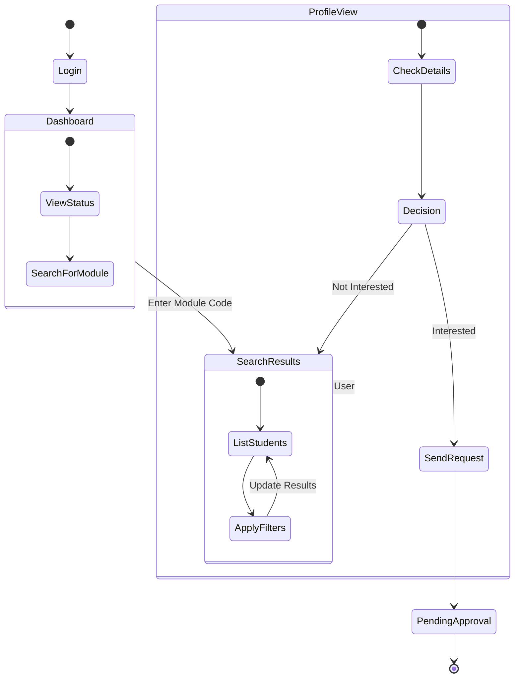

## 📌 Activity Diagram – Finding a Study Buddy

```mermaid
stateDiagram-v2
    [*] --> Login
    Login --> Dashboard
    
    state Dashboard {
        [*] --> ViewStatus
        ViewStatus --> SearchForModule
    }

    Dashboard --> SearchResults: Enter Module Code
    
    state SearchResults {
        [*] --> ListStudents
        ListStudents --> ApplyFilters
        ApplyFilters --> ListStudents: Update Results
    }

    SearchResults --> ProfileView: Click User
    
    state ProfileView {
        [*] --> CheckDetails
        CheckDetails --> Decision
        Decision --> SendRequest: Interested
        Decision --> SearchResults: Not Interested
    }

    SendRequest --> PendingApproval
    PendingApproval --> [*]
```
