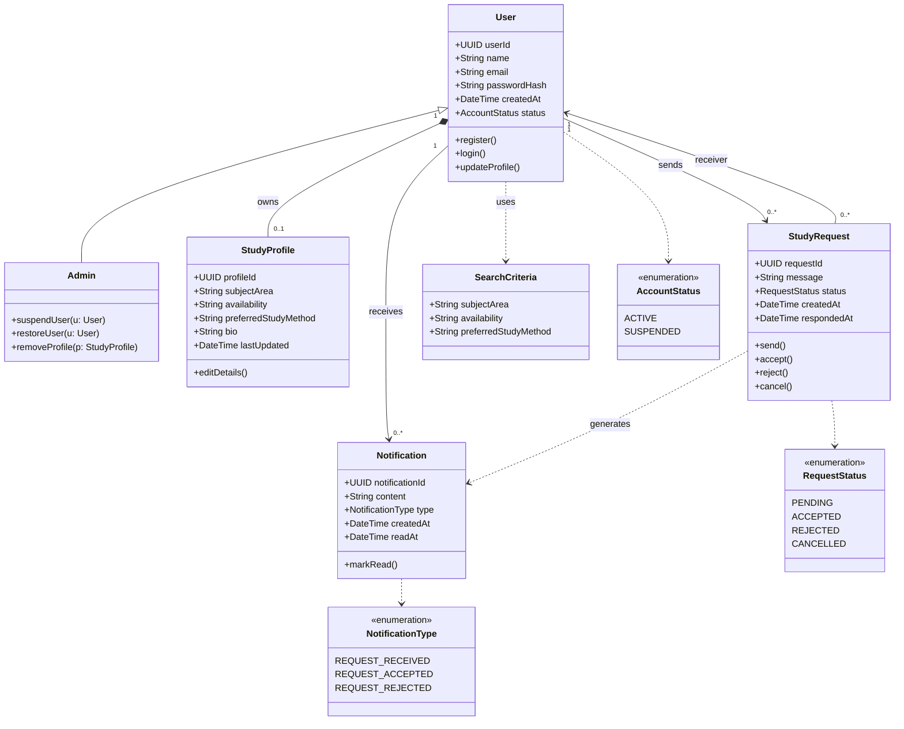

## 📌 Class Diagram – StudyBuddy (Academic Version)

```mermaid
classDiagram

%% ========================
%% Core Domain Classes
%% ========================

class User {
  +UUID userId
  +String name
  +String email
  +String passwordHash
  +DateTime createdAt
  +AccountStatus status
  +register()
  +login()
  +updateProfile()
}

class Admin {
  +suspendUser(u: User)
  +restoreUser(u: User)
  +removeProfile(p: StudyProfile)
}

class StudyProfile {
  +UUID profileId
  +String subjectArea
  +String availability
  +String preferredStudyMethod
  +String bio
  +DateTime lastUpdated
  +editDetails()
}

class StudyRequest {
  +UUID requestId
  +String message
  +RequestStatus status
  +DateTime createdAt
  +DateTime respondedAt
  +send()
  +accept()
  +reject()
  +cancel()
}

class Notification {
  +UUID notificationId
  +String content
  +NotificationType type
  +DateTime createdAt
  +DateTime readAt
  +markRead()
}

class SearchCriteria {
  +String subjectArea
  +String availability
  +String preferredStudyMethod
}

%% ========================
%% Enumerations
%% ========================

class RequestStatus {
  <<enumeration>>
  PENDING
  ACCEPTED
  REJECTED
  CANCELLED
}

class AccountStatus {
  <<enumeration>>
  ACTIVE
  SUSPENDED
}

class NotificationType {
  <<enumeration>>
  REQUEST_RECEIVED
  REQUEST_ACCEPTED
  REQUEST_REJECTED
}

%% ========================
%% Relationships
%% ========================

User <|-- Admin

User "1" *-- "0..1" StudyProfile : owns

User "1" --> "0..*" StudyRequest : sends
StudyRequest "0..*" --> "1" User : receiver

User "1" --> "0..*" Notification : receives

StudyRequest ..> Notification : generates
User ..> SearchCriteria : uses

User ..> AccountStatus
StudyRequest ..> RequestStatus
Notification ..> NotificationType
```
