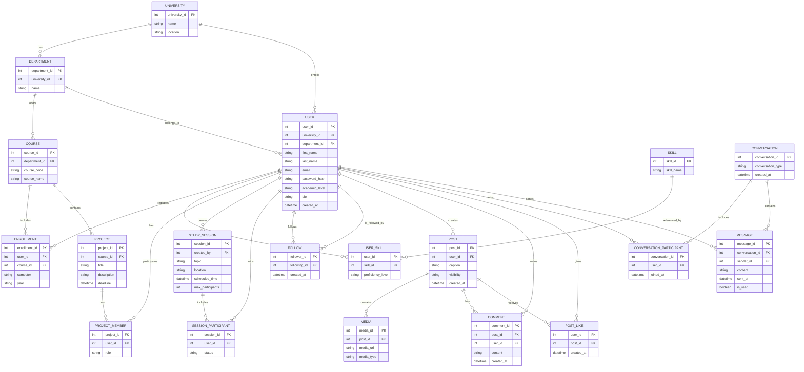

# StudyBuddy App – ER Diagram

```mermaid
erDiagram

    %% --- CORE STRUCTURE ---

    UNIVERSITY ||--o{ DEPARTMENT : has
    UNIVERSITY ||--o{ USER : enrolls

    DEPARTMENT ||--o{ COURSE : offers
    DEPARTMENT ||--o{ USER : belongs_to

    USER ||--o{ ENROLLMENT : registers
    COURSE ||--o{ ENROLLMENT : includes

    USER ||--o{ USER_SKILL : has
    SKILL ||--o{ USER_SKILL : referenced_by

    %% --- PROJECTS ---

    COURSE ||--o{ PROJECT : contains
    PROJECT ||--o{ PROJECT_MEMBER : has
    USER ||--o{ PROJECT_MEMBER : participates

    %% --- STUDY SESSIONS ---

    USER ||--o{ STUDY_SESSION : creates
    STUDY_SESSION ||--o{ SESSION_PARTICIPANT : includes
    USER ||--o{ SESSION_PARTICIPANT : joins

    %% --- SOCIAL FOLLOW SYSTEM ---

    USER ||--o{ FOLLOW : follows
    USER ||--o{ FOLLOW : is_followed_by

    %% --- SOCIAL POSTS ---

    USER ||--o{ POST : creates
    POST ||--o{ MEDIA : contains
    POST ||--o{ COMMENT : has
    USER ||--o{ COMMENT : writes
    POST ||--o{ POST_LIKE : receives
    USER ||--o{ POST_LIKE : gives

    %% --- MESSAGING SYSTEM ---

    USER ||--o{ CONVERSATION_PARTICIPANT : joins
    CONVERSATION ||--o{ CONVERSATION_PARTICIPANT : includes
    CONVERSATION ||--o{ MESSAGE : contains
    USER ||--o{ MESSAGE : sends


    %% =========================
    %% ====== ENTITIES =========
    %% =========================

    UNIVERSITY {
        int university_id PK
        string name
        string location
    }

    DEPARTMENT {
        int department_id PK
        int university_id FK
        string name
    }

    USER {
        int user_id PK
        int university_id FK
        int department_id FK
        string first_name
        string last_name
        string email
        string password_hash
        string academic_level
        string bio
        datetime created_at
    }

    COURSE {
        int course_id PK
        int department_id FK
        string course_code
        string course_name
    }

    ENROLLMENT {
        int enrollment_id PK
        int user_id FK
        int course_id FK
        string semester
        string year
    }

    SKILL {
        int skill_id PK
        string skill_name
    }

    USER_SKILL {
        int user_id FK
        int skill_id FK
        string proficiency_level
    }

    PROJECT {
        int project_id PK
        int course_id FK
        string title
        string description
        datetime deadline
    }

    PROJECT_MEMBER {
        int project_id FK
        int user_id FK
        string role
    }

    STUDY_SESSION {
        int session_id PK
        int created_by FK
        string topic
        string location
        datetime scheduled_time
        int max_participants
    }

    SESSION_PARTICIPANT {
        int session_id FK
        int user_id FK
        string status
    }

    FOLLOW {
        int follower_id FK
        int following_id FK
        datetime created_at
    }

    POST {
        int post_id PK
        int user_id FK
        string caption
        string visibility
        datetime created_at
    }

    MEDIA {
        int media_id PK
        int post_id FK
        string media_url
        string media_type
    }

    COMMENT {
        int comment_id PK
        int post_id FK
        int user_id FK
        string content
        datetime created_at
    }

    POST_LIKE {
        int user_id FK
        int post_id FK
        datetime created_at
    }

    CONVERSATION {
        int conversation_id PK
        string conversation_type
        datetime created_at
    }

    CONVERSATION_PARTICIPANT {
        int conversation_id FK
        int user_id FK
        datetime joined_at
    }

    MESSAGE {
        int message_id PK
        int conversation_id FK
        int sender_id FK
        string content
        datetime sent_at
        boolean is_read
    }
```
