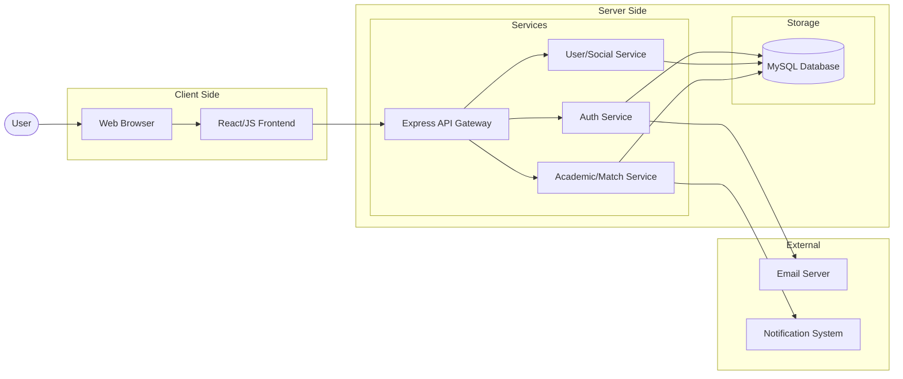

## 📌 System Flowchart – StudyBuddy Architecture

```mermaid
flowchart LR
    User([User]) --> Browser[Web Browser]
    
    subgraph "Client Side"
        Browser --> Frontend[React/JS Frontend]
    end

    subgraph "Server Side"
        Frontend --> API[Express API Gateway]
        
        subgraph Services
            API --> Auth[Auth Service]
            API --> UserS[User/Social Service]
            API --> Acad[Academic/Match Service]
        end
        
        subgraph Storage
            Auth --> DB[(MySQL Database)]
            UserS --> DB
            Acad --> DB
        end
    end

    subgraph "External"
        Auth --> Email[Email Server]
        Acad --> Notify[Notification System]
    end
```
