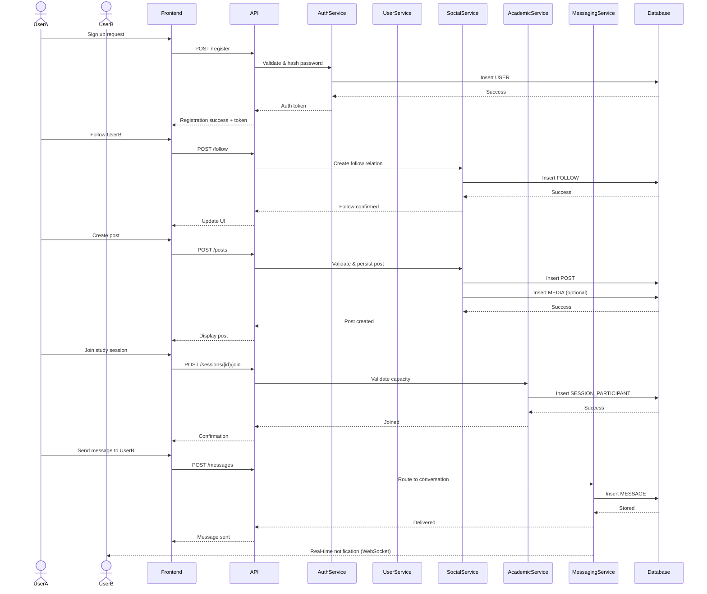

# StudyBuddy App – Sequence Diagram

```mermaid
sequenceDiagram

    actor UserA
    actor UserB
    participant Frontend
    participant API
    participant AuthService
    participant UserService
    participant SocialService
    participant AcademicService
    participant MessagingService
    participant Database

    %% --- USER REGISTRATION ---

    UserA->>Frontend: Sign up request
    Frontend->>API: POST /register
    API->>AuthService: Validate & hash password
    AuthService->>Database: Insert USER
    Database-->>AuthService: Success
    AuthService-->>API: Auth token
    API-->>Frontend: Registration success + token

    %% --- FOLLOW USER ---

    UserA->>Frontend: Follow UserB
    Frontend->>API: POST /follow
    API->>SocialService: Create follow relation
    SocialService->>Database: Insert FOLLOW
    Database-->>SocialService: Success
    SocialService-->>API: Follow confirmed
    API-->>Frontend: Update UI

    %% --- CREATE POST ---

    UserA->>Frontend: Create post
    Frontend->>API: POST /posts
    API->>SocialService: Validate & persist post
    SocialService->>Database: Insert POST
    SocialService->>Database: Insert MEDIA (optional)
    Database-->>SocialService: Success
    SocialService-->>API: Post created
    API-->>Frontend: Display post

    %% --- JOIN STUDY SESSION ---

    UserA->>Frontend: Join study session
    Frontend->>API: POST /sessions/{id}/join
    API->>AcademicService: Validate capacity
    AcademicService->>Database: Insert SESSION_PARTICIPANT
    Database-->>AcademicService: Success
    AcademicService-->>API: Joined
    API-->>Frontend: Confirmation

    %% --- SEND MESSAGE ---

    UserA->>Frontend: Send message to UserB
    Frontend->>API: POST /messages
    API->>MessagingService: Route to conversation
    MessagingService->>Database: Insert MESSAGE
    Database-->>MessagingService: Stored
    MessagingService-->>API: Delivered
    API-->>Frontend: Message sent

    MessagingService-->>UserB: Real-time notification (WebSocket)
```
