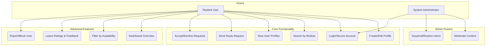

## 📌 Use Case Diagram – StudyBuddy

```mermaid
graph TD
    subgraph Actors
        Student[Student User]
        Admin[System Administrator]
    end

    subgraph "Core Functionality"
        UC1(Create/Edit Profile)
        UC2(Login/Secure Account)
        UC3(Search by Module)
        UC4(View User Profiles)
        UC5(Send Study Request)
        UC6(Accept/Decline Requests)
    end

    subgraph "Advanced Features"
        UC7(Dashboard Overview)
        UC8(Filter by Availability)
        UC9(Leave Ratings & Feedback)
        UC10(Report/Block User)
    end

    subgraph "Admin Powers"
        UC11(Moderate Content)
        UC12(Suspend/Restore Users)
    end

    Student --> UC1
    Student --> UC2
    Student --> UC3
    Student --> UC4
    Student --> UC5
    Student --> UC6
    Student --> UC7
    Student --> UC8
    Student --> UC9
    Student --> UC10

    Admin --> UC11
    Admin --> UC12
    Admin --> UC2
```
